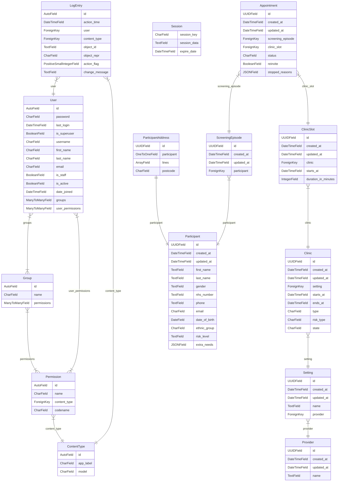

```mermaid
---
Django ER Diagram
---
erDiagram
LogEntry {
    AutoField id
    DateTimeField action_time
    ForeignKey user
    ForeignKey content_type
    TextField object_id
    CharField object_repr
    PositiveSmallIntegerField action_flag
    TextField change_message
}
Permission {
    AutoField id
    CharField name
    ForeignKey content_type
    CharField codename
}
Group {
    AutoField id
    CharField name
    ManyToManyField permissions
}
User {
    AutoField id
    CharField password
    DateTimeField last_login
    BooleanField is_superuser
    CharField username
    CharField first_name
    CharField last_name
    CharField email
    BooleanField is_staff
    BooleanField is_active
    DateTimeField date_joined
    ManyToManyField groups
    ManyToManyField user_permissions
}
ContentType {
    AutoField id
    CharField app_label
    CharField model
}
Session {
    CharField session_key
    TextField session_data
    DateTimeField expire_date
}
Provider {
    UUIDField id
    DateTimeField created_at
    DateTimeField updated_at
    TextField name
}
Setting {
    UUIDField id
    DateTimeField created_at
    DateTimeField updated_at
    TextField name
    ForeignKey provider
}
Clinic {
    UUIDField id
    DateTimeField created_at
    DateTimeField updated_at
    ForeignKey setting
    DateTimeField starts_at
    DateTimeField ends_at
    CharField type
    CharField risk_type
    CharField state
}
ClinicSlot {
    UUIDField id
    DateTimeField created_at
    DateTimeField updated_at
    ForeignKey clinic
    DateTimeField starts_at
    IntegerField duration_in_minutes
}
Participant {
    UUIDField id
    DateTimeField created_at
    DateTimeField updated_at
    TextField first_name
    TextField last_name
    TextField gender
    TextField nhs_number
    TextField phone
    CharField email
    DateField date_of_birth
    CharField ethnic_group
    TextField risk_level
    JSONField extra_needs
}
ParticipantAddress {
    UUIDField id
    OneToOneField participant
    ArrayField lines
    CharField postcode
}
ScreeningEpisode {
    UUIDField id
    DateTimeField created_at
    DateTimeField updated_at
    ForeignKey participant
}
Appointment {
    UUIDField id
    DateTimeField created_at
    DateTimeField updated_at
    ForeignKey screening_episode
    ForeignKey clinic_slot
    CharField status
    BooleanField reinvite
    JSONField stopped_reasons
}
LogEntry }|--|| User : user
LogEntry }|--|| ContentType : content_type
Permission }|--|| ContentType : content_type
Group }|--|{ Permission : permissions
User }|--|{ Group : groups
User }|--|{ Permission : user_permissions
Setting }|--|| Provider : provider
Clinic }|--|| Setting : setting
ClinicSlot }|--|| Clinic : clinic
ParticipantAddress ||--|| Participant : participant
ScreeningEpisode }|--|| Participant : participant
Appointment }|--|| ScreeningEpisode : screening_episode
Appointment }|--|| ClinicSlot : clinic_slot
```
